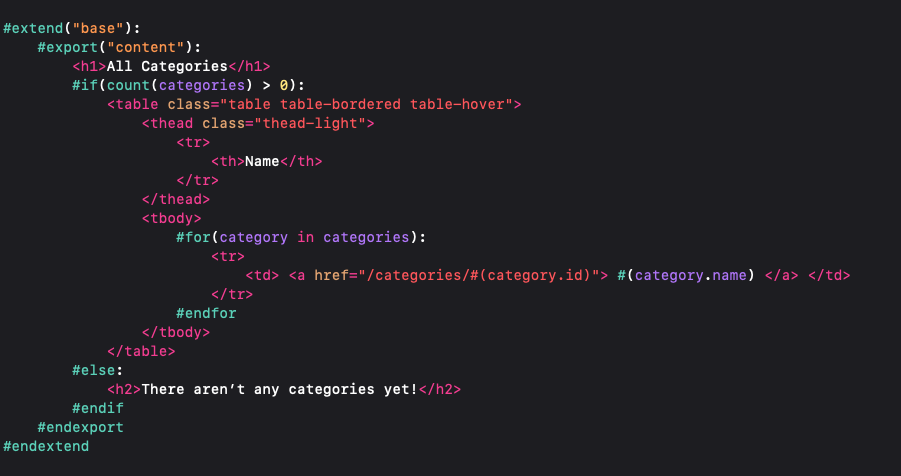

# Vapor Leaf Extension

Update: The Vapor Leaf  Extension is now meant to be used with the Xcode Plugin I designed to provide Xcode language support for the Vapor Leaf language. The version for HTML syntax support only can be found in the dedicated [branch](https://github.com/OmranK/LeafSyntaxHighlighter/tree/html-only).

## Vapor Leaf Plugin
[Download](https://github.com/OmranK/VaporLeafPlugIn) and set up the Vapor Leaf Plugin for custom syntax highlighting and indentation for Leaf tags with HTML tags.

 &nbsp;

## Vapor Leaf Extension
This Application registers Vapor Leaf's .leaf file type to LaunchServices adding custom file icon for the file type inside Xcode and in the Finder. [Download](https://github.com/OmranK/LeafSyntaxHighlighter/releases/tag/v2.0) and run just once for desired result.

 &nbsp;  &nbsp;

To create your own custom icon follow the Apple Developer Documentation: [Design and implement macOS document icons](https://developer.apple.com/news/?id=5i6jlf4d)

**Important**: Make sure to avoid registering the Document Type Identifier before you have your icon perfect. Once the file type is registered, it is very hard to reset. I had to rebuild my LaunchServices database using [Onyx](https://www.titanium-software.fr/en/onyx.html) to reset it. Remove the document type preset in the project by deleting the "Document types" key from the project's Info.plist.

**Tips**: LaunchServices is where the file association is stored. The association is easily unregistered while Document Type has not been registered. Once the Document Type was registered I found very hard to reset. Below are 2 command line code snippets that helped me while I was trying to design the icon.

View all LaunchServices associations:
``/System/Library/Frameworks/CoreServices.framework/Versions/A/Frameworks/LaunchServices.framework/Versions/A/Support/lsregister -dump``

Command-F to search for file type, .leaf in this case. Once you find the path name for the project that registered this file type you can unregister it:
``/System/Library/Frameworks/CoreServices.framework/Versions/A/Frameworks/LaunchServices.framework/Versions/A/Support/lsregister -u <path to bundle>``
